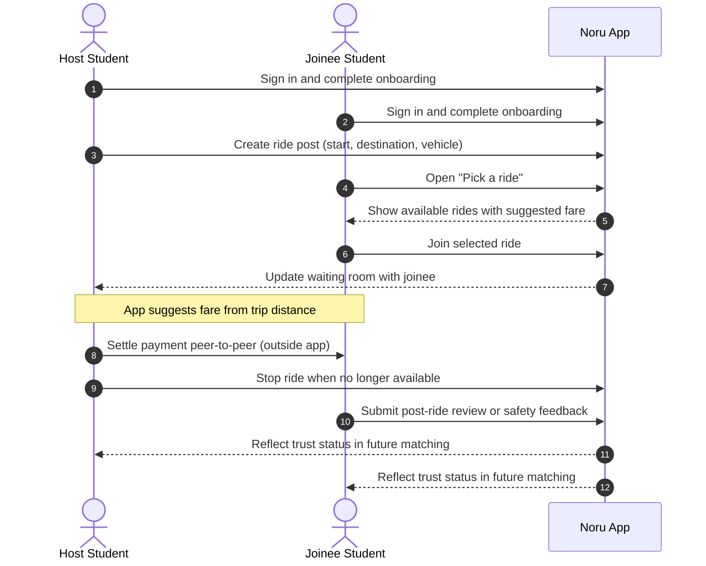

# Noru user flow sequence diagram

```mermaid
sequenceDiagram
  autonumber
  actor H as Host Student
  actor J as Joinee Student
  participant A as Noru App

  H->>A: Sign in and complete onboarding
  J->>A: Sign in and complete onboarding

  H->>A: Create ride post (start, destination, vehicle)
  J->>A: Open "Pick a ride"
  A-->>J: Show available rides with suggested fare
  J->>A: Join selected ride
  A-->>H: Update waiting room with joinee

  Note over H,J: App suggests fare from trip distance
  H->>J: Settle payment peer-to-peer (outside app)

  H->>A: Stop ride when no longer available

  J->>A: Submit post-ride review or safety feedback
  A-->>H: Reflect trust status in future matching
  A-->>J: Reflect trust status in future matching
```
