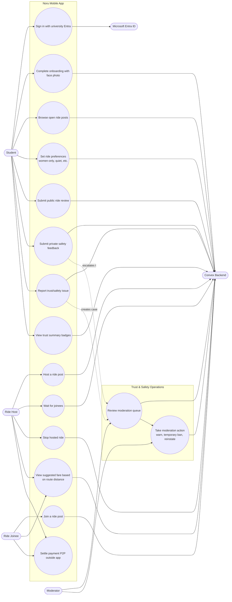

# Noru system diagrams

## Use case diagram

```mermaid
flowchart LR
  student([Student])
  host([Ride Host])
  joinee([Ride Joinee])
  moderator([Moderator])
  entra([Microsoft Entra ID])
  convex([Convex Backend])

  subgraph App["Noru Mobile App"]
    UC1((Sign in with university Entra))
    UC2((Complete onboarding with face photo))
    UC3((Browse open ride posts))
    UC4((Host a ride post))
    UC5((Wait for joinees))
    UC6((Join a ride post))
    UC7((Stop hosted ride))
    UC8((Set ride preferences\nwomen-only, quiet, etc.))
    UC9((Submit public ride review))
    UC10((Submit private safety feedback))
    UC11((Report trust/safety issue))
    UC12((View trust summary badges))
    UC15((View suggested fare based on route distance))
    UC16((Settle payment P2P outside app))
  end

  subgraph TrustOps["Trust & Safety Operations"]
    UC13((Review moderation queue))
    UC14((Take moderation action\nwarn, temporary ban, reinstate))
  end

  student --> UC1
  student --> UC2
  student --> UC3
  student --> UC8
  student --> UC9
  student --> UC10
  student --> UC11
  student --> UC12

  host --> UC4
  host --> UC5
  host --> UC7
  host --> UC15
  host --> UC16

  joinee --> UC6
  joinee --> UC15
  joinee --> UC16

  moderator --> UC13
  moderator --> UC14

  UC1 --> entra
  UC2 --> convex
  UC3 --> convex
  UC4 --> convex
  UC5 --> convex
  UC6 --> convex
  UC7 --> convex
  UC8 --> convex
  UC9 --> convex
  UC10 --> convex
  UC11 --> convex
  UC12 --> convex
  UC15 --> convex
  UC13 --> convex
  UC14 --> convex

  UC10 -.escalates to.-> UC13
  UC11 -.creates case.-> UC13
  UC13 --> UC14
```

## Sequence diagram

See [doc/sequence-user-flow.md](doc/sequence-user-flow.md) for the high-level user-flow sequence diagram.
